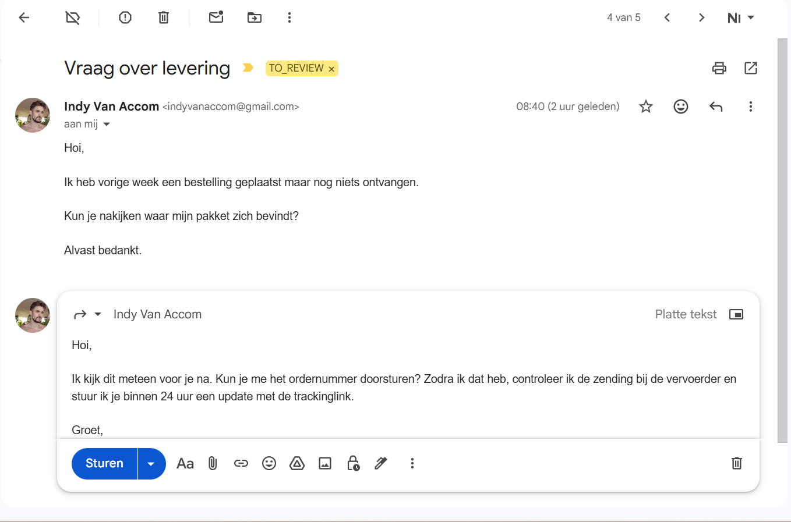
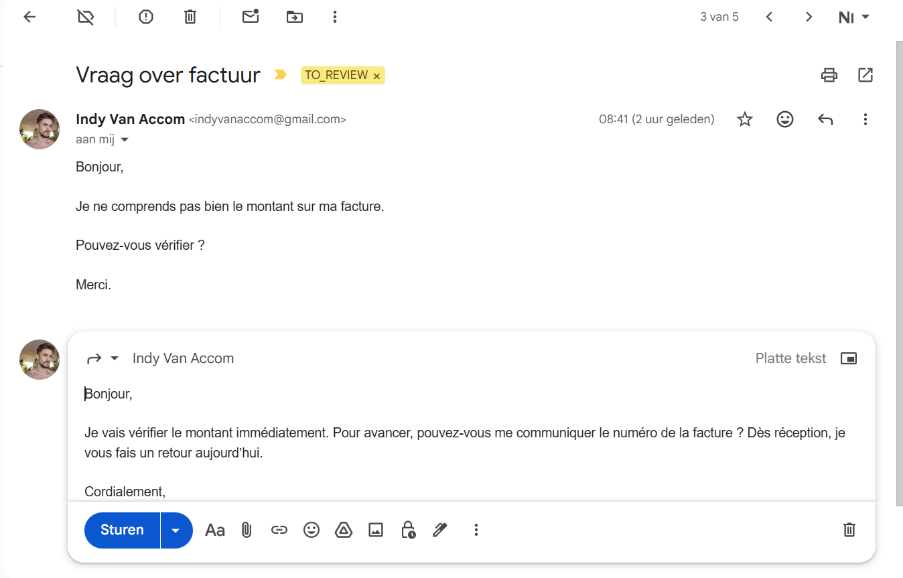
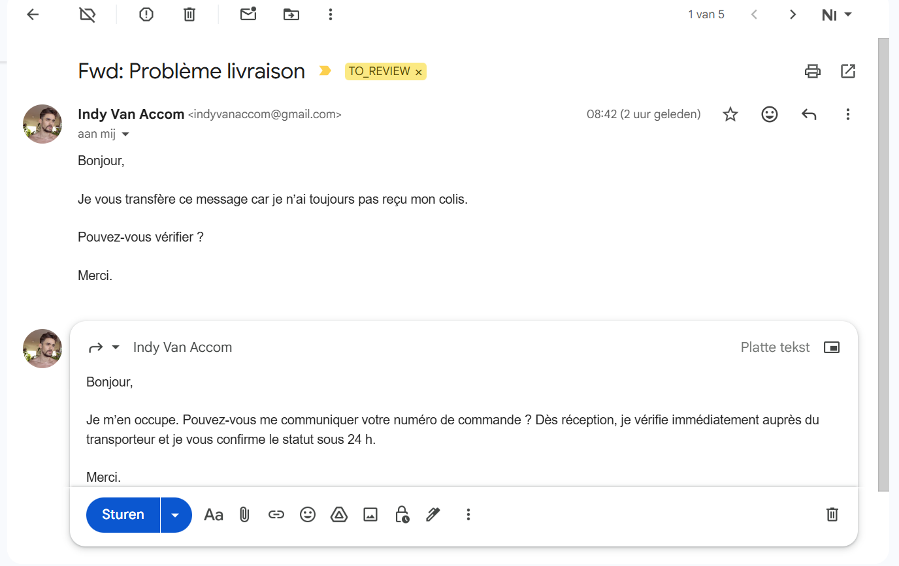
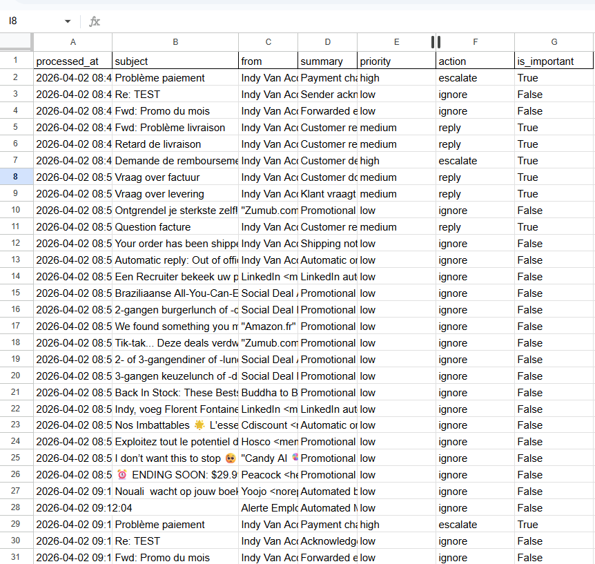
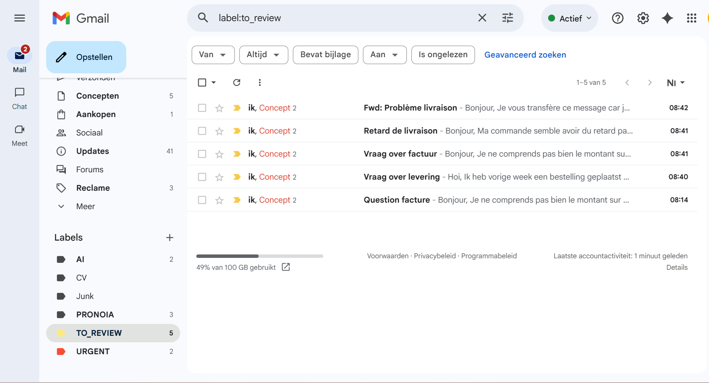
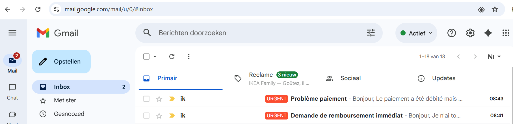

# 📸 Example output









→ Log result to Google Sheets

→ After manual send:
   → Thread is automatically archived
```

---

## 🧱 Tech Stack

- Python
- Gmail API
- OpenAI API
- Google Sheets API
- httpx
- python-dotenv
- BeautifulSoup

---

## 📁 Project Structure

```
email-triage/
│
├── main.py
├── actions.py
├── ai.py
├── gmail_client.py
├── parser.py
├── sheets_client.py
│
├── requirements.txt
├── README.md
├── .env.example
├── .gitignore
│
├── tests/
├── logs/
└── config/
```

---

## 🔧 Setup

### 1. Install dependencies

```bash
pip install -r requirements.txt
```

### 2. Environment variables

Create a `.env` file:

```
OPENAI_API_KEY=your_api_key_here
```

### 3. Google APIs

- Enable Gmail API
- Enable Google Sheets API
- Place credentials in `/config`

```
config/
├── credentials.json
├── token.json
└── service_account.json
```

---

## ▶️ Run

```bash
python main.py
```

---

## 🏷️ Labels

- `TO_REVIEW` → Draft ready for validation and sending
- `URGENT` → Requires immediate manual attention

---

## 📊 Google Sheets Log

Every processed email is logged with:

| Field | Description |
|---|---|
| Subject | Email subject |
| Sender | Sender address |
| Summary | AI-generated summary |
| Priority | `high` / `medium` / `low` |
| Action | `reply` / `escalate` / `ignore` |
| Timestamp | Processing time |

This provides a clear audit trail of all decisions made by the system.

---

## 🧠 Decision Logic

- `reply` → standard customer questions (delivery, invoice, order status)
- `escalate` → refund threats, payment issues, aggressive tone, legal or financial risk
- `ignore` → newsletters, promotions, auto-replies, system emails, irrelevant forwards

---

## 🔒 Safety Design

- Drafts are not automatically sent
- Urgent emails remain visible in the inbox
- Spam and automated emails are filtered out
- Human validation is required before sending replies

---

## ⚠️ Known Limitations

- Classification depends on prompt quality and input clarity
- Edge cases may still require manual review
- No customer history or conversation memory yet
- Gmail cleanup depends on consistent label usage

---

## 🚀 Next Improvements

- Add escalation reason logging
- Add confidence scoring for classification
- Slack / Telegram notifications for urgent emails
- Auto-send for low-risk replies (with safeguards)
- Multi-message context awareness

---
### Google Sheets — Full audit log of all processed emails

...existing code...
